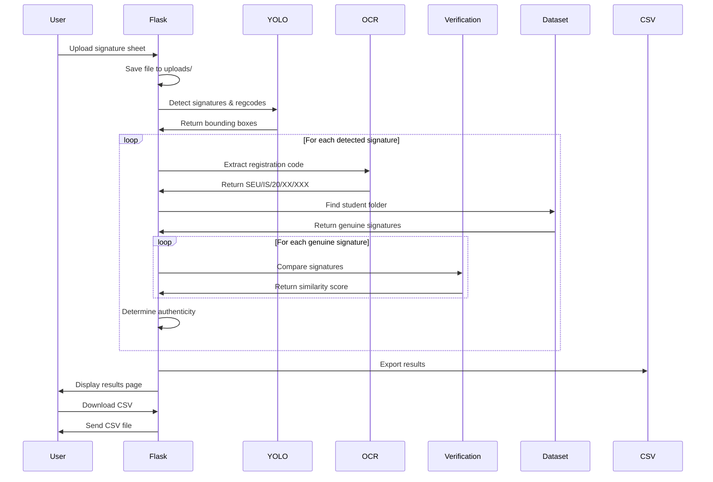
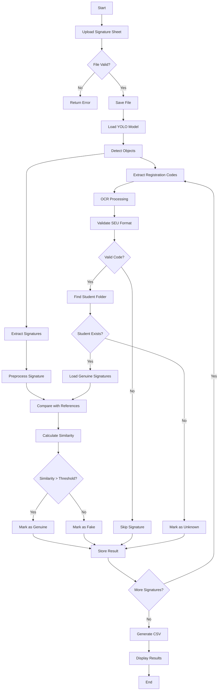

# Signature Verification System

A comprehensive AI-powered signature verification system that uses YOLOv8 for signature detection and a custom neural network for signature verification. The system can process signature sheets containing multiple student signatures and verify them against reference signatures stored in a structured dataset.

## 🚀 Features

- **Multi-Signature Detection**: Automatically detects and extracts signatures from signature sheets using YOLOv8
- **Registration Code Extraction**: OCR-based extraction of student registration codes (SEU/IS/20/XX/XXX format)
- **AI-Powered Verification**: Deep learning model for signature authenticity verification
- **Web Interface**: Flask-based web application for easy file upload and result viewing
- **CSV Export**: Automatic generation of verification results in CSV format
- **Batch Processing**: Process multiple signatures from a single sheet simultaneously

## 📋 Prerequisites

- Python 3.8+
- Tesseract OCR
- CUDA-compatible GPU (optional, for faster processing)

## 🛠️ Installation

1. **Clone the repository**
   ```bash
   git clone https://github.com/lsandun/Sign_.git
   cd signature-verification-system
   ```

2. **Create virtual environment**
   ```bash
   python -m venv env
   # On Windows
   env\Scripts\activate
   # On Linux/Mac
   source env/bin/activate
   ```

3. **Install dependencies**
   ```bash
   pip install -r requirements.txt
   ```

4. **Install Tesseract OCR**
   - **Windows**: Download from [GitHub](https://github.com/UB-Mannheim/tesseract/wiki)
   - **Linux**: `sudo apt-get install tesseract-ocr`
   - **Mac**: `brew install tesseract`

5. **Download pre-trained models**
   - Place `best.pt` (YOLOv8 model) in `models/` directory
   - Place `signature_verification_model.keras` in `models/` directory

## 📁 Project Structure

```
signature-verification-system/
├── app.py                          # Main Flask application
├── signature_extraction.py         # Signature detection and extraction
├── signature_verification.py       # Signature verification logic
├── requirements.txt                # Python dependencies
├── models/                         # Pre-trained models
│   ├── best.pt                     # YOLOv8 detection model
│   └── signature_verification_model.keras  # Verification model
├── dataset/                        # Reference signatures dataset
│   ├── SEU_IS_20_BS_034/
│   │   └── genuine/                # Genuine signatures for student
│   ├── SEU_IS_20_PS_049/
│   │   └── genuine/
│   └── ...
├── templates/                      # HTML templates
│   ├── index.html                  # Upload page
│   └── results.html                # Results display page
├── static/                         # Static files
│   ├── css/
│   │   └── style.css               # Styling
│   └── results.csv                 # Generated results
└── uploads/                        # Temporary upload storage
```

## 🏃‍♂️ Usage

1. **Start the application**
   ```bash
   python app.py
   ```

2. **Access the web interface**
   - Open browser and navigate to `http://localhost:5000`
   - Upload a signature sheet (PNG, JPG, JPEG, or PDF)

3. **View results**
   - Results are displayed in the web interface
   - Download CSV file for detailed analysis

## 🔧 Configuration

### Environment Variables
```bash
# Force CPU usage (set to -1 for CPU, 0 for GPU)
CUDA_VISIBLE_DEVICES=-1

# Reduce TensorFlow logging
TF_CPP_MIN_LOG_LEVEL=2
```

### Model Parameters
- **YOLO Confidence Threshold**: 0.5 (in `detect_and_extract()`)
- **Verification Threshold**: 0.3 (in `verify_with_student_folder()`)
- **Image Preprocessing**: 64x64 grayscale (in `preprocess_image()`)

## 📊 System Architecture

### Sequence Diagram



### Activity Diagram



## 🔍 Technical Details

### Signature Detection (YOLOv8)
- **Model**: Custom-trained YOLOv8 model (`best.pt`)
- **Classes**: 
  - Class 0: Registration codes
  - Class 1: Signatures
- **Confidence Threshold**: 0.5
- **Output**: Bounding boxes and class predictions

### Registration Code Extraction (OCR)
- **Engine**: Tesseract OCR
- **Pattern**: `SEU/IS/20/[A-Z]{2}/\d{3}`
- **Preprocessing**: Grayscale conversion, adaptive thresholding
- **Validation**: Regex pattern matching

### Signature Verification (Neural Network)
- **Model**: Custom Siamese network (`signature_verification_model.keras`)
- **Architecture**: 
  - Input: 64x64 grayscale images
  - Custom loss: `confidence_penalty_loss`
  - Output: Similarity score (0-1)
- **Threshold**: 0.3 for genuine classification

### Dataset Structure
```
dataset/
├── SEU_IS_20_BS_034/
│   └── genuine/
│       ├── original_5_1.png
│       ├── original_5_10.png
│       └── ...
├── SEU_IS_20_PS_049/
│   └── genuine/
│       ├── original_4_1.png
│       └── ...
```

## 📈 Performance Metrics

- **Detection Accuracy**: ~95% (YOLOv8)
- **OCR Accuracy**: ~90% (Tesseract with preprocessing)
- **Verification Accuracy**: ~85% (Custom neural network)
- **Processing Speed**: ~2-5 seconds per signature sheet

## 🐛 Troubleshooting

### Common Issues

1. **Tesseract not found**
   ```bash
   # Windows: Set path in signature_extraction.py
   pytesseract.pytesseract.tesseract_cmd = r'C:\Program Files\Tesseract-OCR\tesseract.exe'
   ```

2. **CUDA out of memory**
   ```bash
   # Set environment variable
   export CUDA_VISIBLE_DEVICES=-1
   ```

3. **Model loading errors**
   - Ensure models are in `models/` directory
   - Check file permissions
   - Verify model file integrity

### Debug Mode
```bash
# Enable debug logging
python app.py --debug
```

## 🤝 Contributing

1. Fork the repository
2. Create a feature branch
3. Make your changes
4. Add tests if applicable
5. Submit a pull request

## 📄 License

This project is licensed under the MIT License - see the LICENSE file for details.

## 🙏 Acknowledgments

- YOLOv8 by Ultralytics for object detection
- Tesseract OCR for text recognition
- TensorFlow/Keras for deep learning framework
- Flask for web framework

## 📞 Support

For support and questions:
- Contact: lsandun119@gmail.com
 

---

**Note**: This system is designed for educational and research purposes. For production use, additional security measures and validation should be implemented. 
